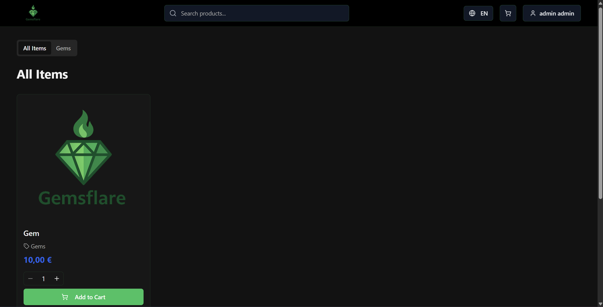
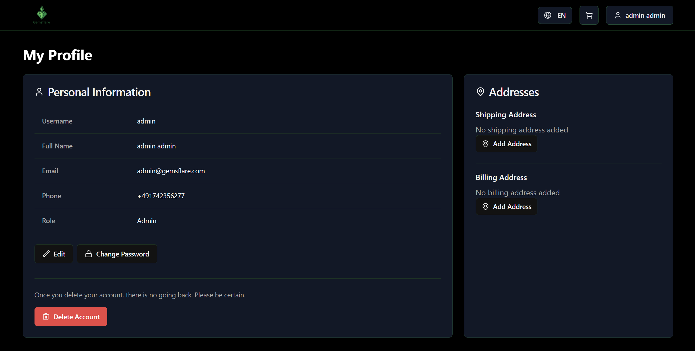
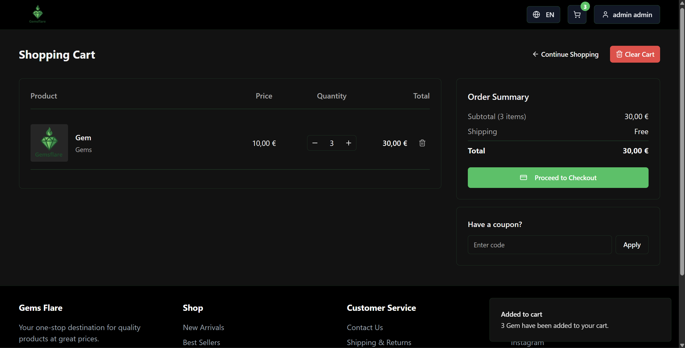

# Gems Flares 💎

## Overview 📖
Gems Flares is a full-stack e-commerce web application built with **Spring Boot** on the backend and **React.js** on the frontend. It provides a simple and user-friendly online store where users can create accounts, browse products, and purchase items.  
This project is developed as a tutorial-style application to demonstrate real-world full-stack web development concepts.

## Features ✨
- **User Authentication**: Users can register, log in, and manage their accounts.
- **Product Browsing**: Browse available products through a clean and responsive interface.
- **Shopping & Checkout**: Add items to the cart and complete purchases.
- **RESTful API**: Communication between frontend and backend using REST APIs.
- **Database Integration**: Persistent data storage using PostgreSQL.
- **Cloud Deployment**: Managed using Google Cloud Console.

## Screenshots 📸
### Home Page

### Profile Page

### Products Page

### Cart / Checkout

## Technologies ⚙️
### Backend
- Spring Boot  
- Java  
- Maven  
- PostgreSQL  

### Frontend
- React.js  
- JavaScript  
- HTML  
- CSS  

### Cloud & Tools
- Google Cloud Console  

## Project Goal 🎯
The goal of Gems Flares is to showcase a complete full-stack web application, covering authentication, backend services, frontend development, database management, and cloud deployment within a single project.
